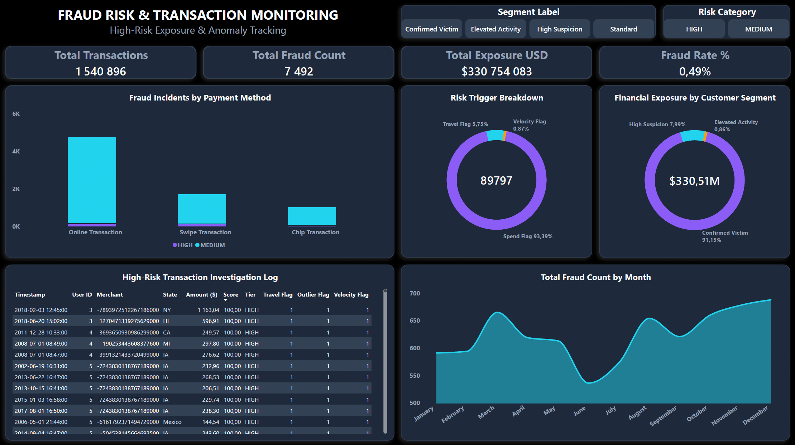
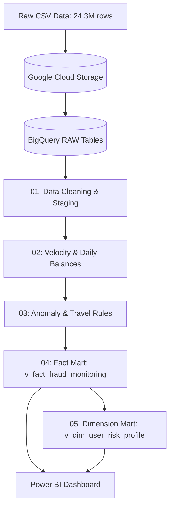

# Banking Transaction & Fraud Risk Analytics (SQL & BigQuery)

## Overview
This project simulates a bank transaction monitoring and fraud detection workflow on a dataset of **24.3 million credit card transactions**. 

The goal was to build an end-to-end data pipeline in **Google BigQuery**: cleaning raw inputs, engineering risk flags via window functions, scoring transaction anomalies, segmenting customers by risk exposure, and visualizing results in an interactive **Power BI** dashboard.

---

## Executive Dashboard (Power BI)



The dashboard serves as an operational monitoring view for fraud analysts:
* **KPI Header:** Tracks total transactions, flagged fraud counts, total exposure, and overall fraud rate.
* **Risk Breakdown:** Analyzes anomalies across payment channels (Online vs. Swipe vs. Chip) and specific trigger types (Spend Outliers, Travel, Velocity).
* **Investigation Log:** Detailed transaction-level grid for reviewing high-risk transactions with active flags.

---

## Architecture & Data Flow



---

## Implementation Steps & Results

### Step 1: Data Cleaning and Staging
🔗 **Source SQL:** [`sql/01_data_cleaning_and_staging.sql`](sql/01_data_cleaning_and_staging.sql)

* Combined integer columns (`Year`, `Month`, `Day`, `Time`) into a single `DATETIME` format (`transaction_datetime`).
* Handled missing merchant locations by assigning `'None'` to explicitly distinguish online transactions from physical store purchases.
* Normalized the fraud indicator (`is_fraud_numeric`) to binary `1`/`0` for simple aggregation.
* Converted currency strings into numeric types.

---

### Step 2: Velocity Checks and Running Daily Spend
🔗 **Source SQL:** [`sql/02_velocity_and_running_balances.sql`](sql/02_velocity_and_running_balances.sql)

* Used `LAG()` across card transactions to compute time differences between consecutive purchases (`time_diff_minutes`).
* Flagged transaction bursts: consecutive purchases at different merchants within $\le 2$ minutes for amounts $\ge \$100$.
* Built intra-day running totals of customer spending using `ROWS BETWEEN UNBOUNDED PRECEDING AND CURRENT ROW`.

---

### Step 3: Spending Outliers & Impossible Travel
🔗 **Source SQL:** [`sql/03_fraud_risk_scoring_rules.sql`](sql/03_fraud_risk_scoring_rules.sql)

* **Spend Outlier:** Calculated each customer's trailing 10-transaction average spend (`ROWS BETWEEN 10 PRECEDING AND 1 PRECEDING`) to flag purchases exceeding $3\times$ their typical baseline ($\ge \$100$).
* **Impossible Travel:** Flagged consecutive in-person transactions across different US states within $< 60$ minutes.

---

### Step 4: Multi-Factor Risk Scoring Mart
🔗 **Source SQL:** [`sql/04_fraud_risk_mart.sql`](sql/04_fraud_risk_mart.sql)

Combined all individual rules into a centralized view with a **Risk Score (0–100 points)**:
* Impossible Travel: **40 pts**
* Spend Outlier: **35 pts**
* Velocity Burst: **25 pts**

Categories assigned:
* **HIGH:** $\ge 60\text{ pts}$
* **MEDIUM:** $25\text{--}59\text{ pts}$
* **LOW:** $< 25\text{ pts}$

#### Results (`v_fact_fraud_monitoring`):
```sql
SELECT 
  risk_category,
  COUNT(*) AS total_transactions,
  SUM(is_fraud_numeric) AS fraud_transactions,
  ROUND(AVG(is_fraud_numeric) * 100, 3) AS fraud_rate_pct,
  ROUND(AVG(risk_score), 1) AS avg_risk_score,
  CAST(ROUND(SUM(amount), 2) AS NUMERIC) AS total_exposure_usd
FROM `project-80dc6d63-b4dc-4c88-a56.banking_dw.v_fact_fraud_monitoring`
GROUP BY risk_category
ORDER BY avg_risk_score DESC;
```

| Risk Category | Total Transactions | Fraud Transactions | Fraud Rate (%) | Avg Risk Score | Total Exposure (USD) |
| :--- | :--- | :--- | :--- | :--- | :--- |
| **HIGH** | 20,876 | 298 | **1.427%** | 71.5 | $5,798,847.12 |
| **MEDIUM** | 1,520,041 | 7,193 | **0.473%** | 35.2 | $324,972,037.24 |
| **LOW** | 22,845,983 | 22,266 | **0.097%** | 0.0 | $733,327,232.88 |

**Takeaway:** The **HIGH** category has a fraud rate of **1.427%** (nearly $15\times$ higher than the baseline rate of 0.097%), while filtering down the review pool to only **20.8k out of 24.3M transactions** ($<0.1\%$).

---

### Step 5: Customer Risk Profiling & Segmentation
🔗 **Source SQL:** [`sql/05_customer_risk_profile.sql`](sql/05_customer_risk_profile.sql)

Aggregated transaction behavior to create a customer-level dimension table (`user_id`):
* **CONFIRMED_VICTIM:** Accounts with at least 1 confirmed fraud transaction.
* **HIGH_SUSPICION:** Accounts with $\ge 3$ HIGH-risk transactions.
* **ELEVATED_ACTIVITY:** Accounts with $\ge 10$ MEDIUM-risk transactions.
* **STANDARD:** Accounts with regular spending patterns.

#### Results (`v_dim_user_risk_profile`):
```sql
SELECT 
  customer_risk_segment,
  COUNT(*) AS total_users,
  SUM(total_transactions) AS total_txns,
  SUM(total_fraud_transactions) AS total_frauds,
  CAST(ROUND(SUM(total_fraud_amount_lost_usd), 2) AS NUMERIC) AS total_fraud_losses_usd
FROM `project-80dc6d63-b4dc-4c88-a56.banking_dw.v_dim_user_risk_profile`
GROUP BY customer_risk_segment
ORDER BY total_frauds DESC;
```

| Customer Risk Segment | Total Users | Total Transactions | Total Confirmed Frauds | Total Fraud Losses (USD) |
| :--- | :--- | :--- | :--- | :--- |
| **CONFIRMED_VICTIM** | 1,343 | 22,127,450 | 29,757 | **$3,231,338.63** |
| **HIGH_SUSPICION** | 181 | 1,877,732 | 0 | $0.00 |
| **ELEVATED_ACTIVITY** | 199 | 298,331 | 0 | $0.00 |
| **STANDARD** | 277 | 83,367 | 0 | $0.00 |

**Takeaway:** Confirmed fraud losses totaled **$3.23M** across 1,343 customers. The model also identified **181 high-suspicion customers** exhibiting repeated anomalies before any fraud report was filed, highlighting an opportunity for proactive alerts.

---

## Key Insights & Recommendations

* **Online Channels Carry the Bulk of the Risk:** The vast majority of flagged transactions and total dollar exposure occur in online purchases, while chip transactions show very low incident rates. Expanding dynamic 3D-Secure or biometric verification specifically for unusual online amounts would prevent the majority of losses.
* **Proactive Intervention on Suspicious Accounts:** The pipeline isolated 181 accounts in the `HIGH_SUSPICION` category with repeated anomalies but no filed fraud reports yet. Setting automated holds or quick SMS/push confirmations on these accounts could prevent fraud before chargebacks occur.
* **Efficient Analyst Triage:** Filtering down 24.3M transactions to roughly 20.8k high-risk cases allows operations teams to focus review efforts where fraud density is nearly 15× the portfolio average.

---

## Repository Structure

* **`sql/`**
  * `01_data_cleaning_and_staging.sql` – Raw data type conversions, timestamp parsing, and staging view creation.
  * `02_velocity_and_running_balances.sql` – Time-delta calculations, rapid-fire velocity flags, and daily cumulative sums.
  * `03_fraud_risk_scoring_rules.sql` – Trailing spend averages, outlier detection, and state travel hops.
  * `04_fraud_risk_mart.sql` – Fact mart view with composite risk score and risk tier categorization.
  * `05_customer_risk_profile.sql` – Customer dimension aggregation and behavioral risk segmentation.
* **`Visuals/`**
  * `banking_fraud_risk_dashboard.pbix` – Interactive Power BI report file.
  * `banking_fraud_risk_dashboard.pdf` – Exported report preview.
  * `Fraud Analysis Dashboard Preview.png` – Dashboard overview screenshot.
* **`data/`** – Directory placeholder for source data schemas and documentation.
* **`README.md`** – Project documentation, analytical findings, and query outputs.

---

## Tech Stack
* **Cloud Data Warehouse:** Google BigQuery
* **Storage:** Google Cloud Storage (GCS)
* **SQL Techniques:** CTEs, Window Frames (`ROWS BETWEEN`), `LAG()`, `DATETIME_DIFF()`, View Materialization
* **BI & Reporting:** Power BI Desktop (DAX, Data Modeling, Dashboard Design)