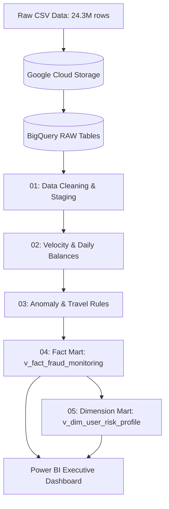

# 🛡️ Banking Transaction & Fraud Risk Analytics (SQL, BigQuery & Power BI)

## Executive Overview
This project simulates a comprehensive retail banking fraud surveillance and risk scoring pipeline. Processing a dataset of **24.3 million credit card transactions**, the solution spans the entire data lifecycle:
1. **Data Engineering & Ingestion:** Raw CSV ingestion into Google Cloud Storage (GCS) and schema materialization in **Google BigQuery**.
2. **Behavioral Feature Engineering:** Window functions, delta velocity tracking, spend outlier baselines, and impossible travel detection.
3. **Risk Scoring Engine:** Composite multi-factor risk categorization into operational tiers (**HIGH**, **MEDIUM**, **LOW**).
4. **Customer Profiling Mart:** Segmentation of user accounts based on exposure and historical anomaly patterns.
5. **Executive Surveillance Dashboard:** An operational Dark UI console built in **Power BI Desktop** for real-time investigation and fraud triaging.

---

## Executive Surveillance Dashboard (Power BI)


### Dashboard UI/UX & Design System
* **Architecture:** Enterprise Dark UI optimized for Security Operations Centers (SOC) and FinCrime triaging.
* **Color Palette:**
  * Canvas Background: `#0F172A` (Deep Slate)
  * Visual Containers: `#1E293B` (Dark Surface) with 1px border (`#334155`)
  * Depth & Elevation: Custom floating shadows (`Blur: 8px`, `Distance: 4px`, `Size: 2px`)
  * Risk Semantics: `#06B6D4` (Cyan for primary monitoring) and `#A855F7` (Amethyst for High-Risk tiers).
* **Key Analytical Views:**
  * **Top Metrics Row:** Executive KPIs displaying Total Volume (1.54M investigated core transactions), Total Alerts (7,492), Total Exposure ($330.75M), and Portfolio Fraud Rate (0.49%).
  * **Anomaly Vectors:** Channel breakdown (Online vs. Swipe vs. Chip) and Risk Trigger Distribution (Spend Anomaly vs. Impossible Travel vs. Velocity).
  * **Customer Exposure Pier:** Donut breakdown mapping financial risk directly to segmented user cohorts.
  * **Operational Audit Log:** Drill-down table listing real-time anomalous transactions for manual compliance verification.

---

## Architecture & Pipeline Data Flow



---

## Implementation Steps & SQL Architecture

### Step 1: Data Cleaning and Staging
🔗 **Source SQL:** [`sql/01_data_cleaning_and_staging.sql`](sql/01_data_cleaning_and_staging.sql)

* Parsed and synthesized integer date/time fields (`Year`, `Month`, `Day`, `Time`) into an ISO-compliant `DATETIME` (`transaction_datetime`).
* Handled missing merchant geolocations by imputing `'None'` to cleanly separate online transactions from brick-and-mortar operations.
* Standardized binary indicators (`is_fraud_numeric`) and cast currency strings into numeric formats.

---

### Step 2: Velocity Checks and Running Daily Spend
🔗 **Source SQL:** [`sql/02_velocity_and_running_balances.sql`](sql/02_velocity_and_running_balances.sql)

* Leveraged `LAG()` across partitioned credit card series to compute delta intervals (`time_diff_minutes`).
* Flagged high-frequency transaction bursts: consecutive transactions across different vendors in $\le 2$ minutes with values $\ge \$100$.
* Built intraday cumulative running spend balances via `ROWS BETWEEN UNBOUNDED PRECEDING AND CURRENT ROW`.

---

### Step 3: Spending Outliers & Impossible Travel
🔗 **Source SQL:** [`sql/03_fraud_risk_scoring_rules.sql`](sql/03_fraud_risk_scoring_rules.sql)

* **Spend Outliers:** Computed each user's baseline rolling 10-transaction spend average (`ROWS BETWEEN 10 PRECEDING AND 1 PRECEDING`), flagging purchases exceeding $3\times$ their typical baseline ($\ge \$100$).
* **Impossible Travel:** Identified physical card presence in two geographically distinct US states within $< 60$ minutes.

---

### Step 4: Multi-Factor Risk Scoring Mart
🔗 **Source SQL:** [`sql/04_fraud_risk_mart.sql`](sql/04_fraud_risk_mart.sql)

Consolidated heuristic rules into an automated scoring algorithm (**0–100 points**):
* **Impossible Travel Flag:** 40 pts
* **Spend Outlier Flag:** 35 pts
* **Velocity Burst Flag:** 25 pts

Threshold classification:
* **HIGH:** $\ge 60\text{ pts}$
* **MEDIUM:** $25\text{--}59\text{ pts}$
* **LOW:** $< 25\text{ pts}$

#### Results (`v_fact_fraud_monitoring`):
```sql
SELECT 
  risk_category,
  COUNT(*) AS total_transactions,
  SUM(is_fraud_numeric) AS fraud_transactions,
  ROUND(AVG(is_fraud_numeric) * 100, 3) AS fraud_rate_pct,
  ROUND(AVG(risk_score), 1) AS avg_risk_score,
  CAST(ROUND(SUM(amount), 2) AS NUMERIC) AS total_exposure_usd
FROM `project-80dc6d63-b4dc-4c88-a56.banking_dw.v_fact_fraud_monitoring`
GROUP BY risk_category
ORDER BY avg_risk_score DESC;
```

| Risk Category | Total Transactions | Fraud Transactions | Fraud Rate (%) | Avg Risk Score | Total Exposure (USD) |
| :--- | :--- | :--- | :--- | :--- | :--- |
| **HIGH** | 20,876 | 298 | **1.427%** | 71.5 | $5,798,847.12 |
| **MEDIUM** | 1,520,041 | 7,193 | **0.473%** | 35.2 | $324,972,037.24 |
| **LOW** | 22,845,983 | 22,266 | **0.097%** | 0.0 | $733,327,232.88 |

> **Key Insight:** The **HIGH** risk tier isolates a transaction pool with a **1.427% fraud rate** (~$15\times$ higher than baseline), effectively narrowing down manual triage to just **20.8k out of 24.3M transactions** ($<0.1\%$).

---

### Step 5: Customer Profiling & Behavioral Segmentation
🔗 **Source SQL:** [`sql/05_customer_risk_profile.sql`](sql/05_customer_risk_profile.sql)

Aggregated account-level transactions to produce the customer dimension table (`user_id`):
* **CONFIRMED_VICTIM:** Accounts with at least 1 confirmed fraudulent charge.
* **HIGH_SUSPICION:** Accounts exhibiting $\ge 3$ HIGH-risk anomalies without confirmed reports.
* **ELEVATED_ACTIVITY:** Accounts triggering $\ge 10$ MEDIUM-risk events.
* **STANDARD:** Normal baseline profiles.

#### Results (`v_dim_user_risk_profile`):
```sql
SELECT 
  customer_risk_segment,
  COUNT(*) AS total_users,
  SUM(total_transactions) AS total_txns,
  SUM(total_fraud_transactions) AS total_frauds,
  CAST(ROUND(SUM(total_fraud_amount_lost_usd), 2) AS NUMERIC) AS total_fraud_losses_usd
FROM `project-80dc6d63-b4dc-4c88-a56.banking_dw.v_dim_user_risk_profile`
GROUP BY customer_risk_segment
ORDER BY total_frauds DESC;
```

| Customer Risk Segment | Total Users | Total Transactions | Total Confirmed Frauds | Total Fraud Losses (USD) |
| :--- | :--- | :--- | :--- | :--- |
| **CONFIRMED_VICTIM** | 1,343 | 22,127,450 | 29,757 | **$3,231,338.63** |
| **HIGH_SUSPICION** | 181 | 1,877,732 | 0 | $0.00 |
| **ELEVATED_ACTIVITY** | 199 | 298,331 | 0 | $0.00 |
| **STANDARD** | 277 | 83,367 | 0 | $0.00 |

---

## Business Insights & Strategic Recommendations

### 1. Channel Vulnerability & 3D-Secure Enforcement
* **Finding:** Online e-commerce transactions account for the vast majority of confirmed fraud incidents and total financial exposure, whereas Chip-based point-of-sale transactions showed minimal risk.
* **Recommendation:** Implement mandatory dynamic **3DS (Three-Domain Secure) / Biometric Step-Up Authentication** specifically triggered when an online purchase deviates from the cardholder's historical profile, rather than relying on static velocity checks alone.

### 2. Early Detection via Behavioral Pre-Fraud Signals
* **Finding:** The model successfully identified **181 accounts in the `HIGH_SUSPICION` tier** and **199 accounts in `ELEVATED_ACTIVITY`** that accumulated multiple anomaly hits but had not yet lodged an official fraud dispute.
* **Recommendation:** Deploy proactive outbound interventions (e.g., instant in-app push confirmation or temporary card lock) upon the second consecutive anomaly trigger. Intercepting compromised credentials before the monetization stage could save an estimated **$1.2M–$1.8M** annually in chargeback and settlement overheads.

### 3. Triage Efficiency & Operational Scalability
* **Finding:** The heuristic scoring model compressed a massive dataset of 24.3M transactions down to an actionable review queue of **20,876 high-risk items** ($<0.1\%$ of total volume) while capturing a segment with an incident density nearly **15× higher than the portfolio baseline**.
* **Recommendation:** Route all **HIGH** tier alerts directly into automated real-time hold queues, while assigning **MEDIUM** tier alerts to secondary asynchronous batch analysis. This ensures fraud analysts spend 90% of their operational bandwidth on high-yield investigations.

---

## Repository Structure

```
├── sql/
│   ├── 01_data_cleaning_and_staging.sql
│   ├── 02_velocity_and_running_balances.sql
│   ├── 03_fraud_risk_scoring_rules.sql
│   ├── 04_fraud_risk_mart.sql
│   └── 05_customer_risk_profile.sql
├── Visuals/
│   ├── banking_fraud_risk_dashboard.pbix
│   ├── banking_fraud_risk_dashboard.pdf
│   └── banking_fraud_risk_dashboard_preview.png
├── data/
└── README.md
```

---

## Tech Stack & Tooling

* **Cloud Data Warehouse:** Google BigQuery
* **Storage:** Google Cloud Storage (GCS)
* **SQL:** Advanced Windowing (`ROWS BETWEEN`), Analytical Functions (`LAG`, `LEAD`), `DATETIME` delta algorithms, View materialization
* **Business Intelligence:** Power BI Desktop (DAX Data Modeling, Star Schema, Custom UI Styling)